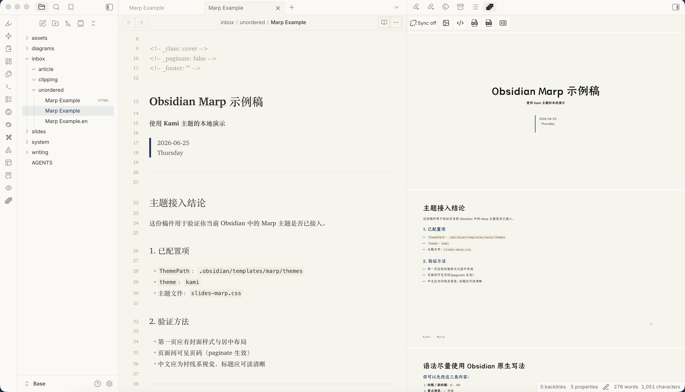

# Marp Extended for Obsidian

Marp Extended is an Obsidian plugin for creating, previewing, presenting, and exporting [Marp](https://marp.app/) slide decks from Markdown notes.

> **Project lineage:** Marp Extended originated from [Samuele Cozzi's Marp Slides for Obsidian](https://github.com/samuele-cozzi/obsidian-marp-slides) and is now maintained as an independent plugin project. Upstream credits are preserved below.



## Project status

| Field | Value |
| --- | --- |
| Plugin name | Marp Extended |
| Plugin/package ID | `marp-extended` |
| Current version | `0.4.0` |
| Repository | <https://github.com/shuuul/obsidian-marp-extended> |

## Features

- Preview Marp slides inside Obsidian.
- Export slide decks as HTML, PDF, PPTX, or images through Marp CLI.
- Present slide decks from the plugin.
- Use bundled Marp theme CSS installed into `.marp-extended/themes/` on first load, plus custom theme CSS from your vault.
- Add custom Marp themes by pasting CSS in plugin settings.
- Convert Obsidian image wiki-links to standard Markdown image links for preview/export.
- Built-in markdown-it extensions for containers, marks, and Mermaid diagrams rendered with `beautiful-mermaid`.

## Markdown compatibility

Marp Extended renders slides with Marp, so notes should primarily use Marp-compatible Markdown. Obsidian image embeds are supported as a convenience by converting image wiki-links before preview/export.

Supported image wiki-link forms:

| Obsidian syntax | Converted Marp-compatible syntax |
| --- | --- |
| `![[image.png]]` | `` |
| `![[image.png\|Alt text]]` | `` |
| `![[image.png\|600]]` | `` |
| `![[image.png\|600x400]]` | `` |

For example:

```md
![[Pasted image 20260625124927.png]]
![[Pasted image 20260625124927.png|Screenshot]]
![[Pasted image 20260625124927.png|600]]
![[Pasted image 20260625124927.png|600x400]]
```

These are converted to standard Markdown image links / Marp image directives. Paths are URL-encoded so spaces become `%20`:

```md


```

When possible, the plugin resolves the image through Obsidian's link resolver and emits a path Marp can read. If the image cannot be resolved, the plugin falls back to treating the wiki-link target as a path relative to the current note.

Other Obsidian-only extensions are not converted automatically. If Marp does not support an Obsidian syntax directly, write it in standard Markdown or Marp syntax.

See also:

- [Marpit Markdown](https://marpit.marp.app/markdown)
- [Marp Core features](https://github.com/marp-team/marp-core#features)
- [Marp CLI](https://github.com/marp-team/marp-cli)

## Getting started

1. Install or build the plugin into your vault's `.obsidian/plugins/marp-extended/` directory.
2. Enable **Marp Extended** in Obsidian community plugin settings.
3. On first load, Marp Extended downloads the default theme catalog from GitHub into `.marp-extended/themes/`.
4. Open a Markdown note and run **Slide Preview** from the command palette or ribbon icon.
5. Use the export commands for PDF, PDF with notes, HTML, PPTX, or PNG.

> ⚠️ PDF, PPTX, and image export require Google Chrome, Chromium, or Microsoft Edge. You can set a custom browser path with the `CHROME_PATH` setting.

## Development

```bash
npm install
npm run typecheck
npm run lint
npm test -- --runInBand
npm run build
```

For live Obsidian testing, copy `.env.local.example` to `.env.local` and set `OBSIDIAN_VAULT` to your vault path. `npm run dev` and `npm run build` will then auto-copy `main.js`, `manifest.json`, and `styles.css` into `<vault>/.obsidian/plugins/marp-extended/`. Reload the dev plugin with the Obsidian CLI:

```bash
npm run obsidian:reload
```

Useful scripts:

| Command | Description |
| --- | --- |
| `npm run dev` | Watch build for local development |
| `npm run build` | Typecheck and produce production `main.js` |
| `npm run typecheck` | Run TypeScript checks only |
| `npm run lint` | Run ESLint over `src` and `tests` |
| `npm test` | Run Jest unit tests |
| `npm run test:coverage` | Run Jest unit tests with coverage |
| `npm run analyze:bundle` | Build and emit `metafile.json` for esbuild bundle analysis |
| `npm run obsidian:reload` | Reload the local Obsidian dev plugin and check dev errors |
| `npm run obsidian:profile -- path="samples/Kami Agent Slides.md"` | Capture preview Chrome metrics and Marp Extended timing marks for a vault-relative note path; pass `cpu=true` for a `.cpuprofile` |

`main.js` is generated. Edit files under `src/`, then rebuild.

Developer guidance lives in [`AGENTS.md`](AGENTS.md). Release notes live in [`CHANGELOG.md`](CHANGELOG.md).

Current Marp-related runtime dependencies are `@marp-team/marp-cli` `^4.4.0`, `@marp-team/marp-core` `^4.3.0`, `beautiful-mermaid` `^1.1.3`, plus bundled markdown-it extensions `markdown-it-container` and `markdown-it-mark`.

## Security note

Runtime dependencies audit clean with `npm audit --omit=dev`. A full `npm audit` currently reports a dev-only moderate `js-yaml` advisory through Istanbul/Jest coverage tooling (`@istanbuljs/load-nyc-config` → `babel-plugin-istanbul` → Jest/ts-jest). `npm audit fix --force` would make breaking test-stack changes, so avoid it unless you are intentionally updating that tooling.

## Upstream credits

Marp Extended builds on the original [Marp Slides for Obsidian](https://github.com/samuele-cozzi/obsidian-marp-slides) plugin by Samuele Cozzi.

Bundled default themes include CSS from [matsubara0507/marp-themes](https://github.com/matsubara0507/marp-themes), [kaisugi/marp-theme-academic](https://github.com/kaisugi/marp-theme-academic), [dracula/marp](https://github.com/dracula/marp), and [tw93/Kami](https://github.com/tw93/Kami), plus Marp Extended sample themes. These upstream projects are MIT-licensed; keep their notices when redistributing modified theme CSS. Kami's Chinese theme references TsangerJinKai02 fonts, whose commercial usage may require a separate font license.

Many thanks to:

- [Obsidian plugin development docs](https://marcus.se.net/obsidian-plugin-docs/)
- [Marp for VS Code](https://github.com/marp-team/marp-vscode)
- [Obsidian API](https://github.com/obsidianmd/obsidian-api)
