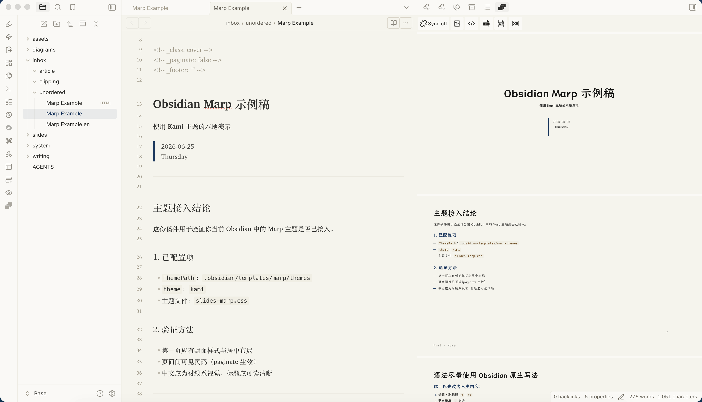

# Marp Extended for Obsidian

[](https://github.com/shuuul/obsidian-marp-extended/releases)
[](https://community.obsidian.md/plugins/marp-extended)

Marp Extended is an Obsidian plugin for creating, previewing, presenting, and exporting [Marp](https://marp.app/) slide decks from Markdown notes.

> **Project lineage:** Marp Extended originated from [Samuele Cozzi's Marp Slides for Obsidian](https://github.com/samuele-cozzi/obsidian-marp-slides) and is now maintained as an independent plugin project. Upstream credits are preserved below.



## Features

- Preview Marp slides inside Obsidian.
- Export slide decks as HTML, PDF, or PPTX through a user-installed Marp CLI.
- Present slide decks from the plugin.
- Use bundled Marp theme CSS installed into `.marp-extended/themes/` on first load, plus custom theme CSS from your vault.
- Add custom Marp themes by pasting CSS in plugin settings.
- Convert Obsidian image wiki-links to standard Markdown image links for preview/export.
- Convert note wiki-links (`[[path|alias]]`) to clickable internal links in the preview sidebar; exports keep only the display text.
- Built-in Mermaid diagrams rendered with `beautiful-mermaid` and official Mermaid, featuring an interactive zooming and panning frame in the editor Live Preview (can be toggled in settings).
- Auto-fit long linear `flowchart LR` / `TD` / `TB` chains into compact zigzag bands so slide scaling keeps node text readable. Turn this off in **Settings → Auto-fit wide Mermaid flowcharts**.
- Use standard Marpit fragments and presenter comments in preview, with fragment commands and a notes panel.
- Add theme-independent Marp Extended comment markers for slide metadata, semantic text, callouts, 1–6 columns, and configurable card grids.
- Keep preview and managed exports on the same shipped Marp Core 5 semantic engine.

## Markdown compatibility

Marp Extended renders slides with Marp, so notes should primarily use Marp-compatible Markdown. Obsidian image embeds are supported as a convenience by converting image wiki-links before preview/export.

Supported image wiki-link forms:

| Obsidian syntax | Converted Marp-compatible syntax |
| --- | --- |
| `![[image.png]]` | `` |
| `![[image.png\|Alt text]]` | `` |
| `![[image.png\|600]]` | `` |
| `![[image.png\|600x400]]` | `` |

For example:

```md
![[Pasted image 20260625124927.png]]
![[Pasted image 20260625124927.png|Screenshot]]
![[Pasted image 20260625124927.png|600]]
![[Pasted image 20260625124927.png|600x400]]
```

These are converted to standard Markdown image links / Marp image directives. Paths are URL-encoded so spaces become `%20`:

```md


```

When possible, the plugin resolves the image through Obsidian's link resolver and emits a path Marp can read. If the image cannot be resolved, the plugin falls back to treating the wiki-link target as a path relative to the current note.

Note wiki-links are also recognized:

```md
基于 [[sources/transcripts/聊聊朱镕基那个时代和经济政策|来源笔记]] · 再快一点
```

The slide shows the alias (`来源笔记`; without an alias, the raw link path). In the preview sidebar the text is clickable and opens the note inside Obsidian (Cmd/Ctrl-click or middle-click opens a new tab; unresolved targets only show a notice). Links with heading or block subpaths (`[[Note#Section]]`, `[[Note#^block]]`) navigate to that location. In HTML/PDF/PPTX exports the link is dropped and only the display text remains. Wiki-link-like text inside fenced code blocks and inline code spans (for example Mermaid `A[[subroutine]]` shapes or `` `[[x]]` `` samples) is left untouched.

Other Obsidian-only extensions are not converted automatically. If Marp does not support an Obsidian syntax directly, write it in standard Markdown or Marp syntax.

Marp Extended inherits standard Marpit slide splitting, directives, images,
backgrounds, scoped styles, fragmented lists, and presenter comments. Marp Core
adds fitting headings, emoji, math, code highlighting, inline SVG, and other Marp
features. The plugin supplies the host behavior that Marpit leaves to an
integrating application: fragment stepping and a presenter-notes panel in the
Obsidian preview.

See also:

- [Marpit Markdown](https://marpit.marp.app/markdown)
- [Marp Core Markdown](https://github.com/marp-team/marp-core/blob/main/docs/markdown.md)
- [Marp CLI](https://github.com/marp-team/marp-cli)

## Marp Extended syntax

Marp Extended adds an Obsidian-friendly `%%marp-*%%` layer only where standard
Marp/Marpit Markdown has no equivalent. The markers compile before preview and
export, while their contents remain ordinary Markdown.

| Purpose | Canonical syntax |
| --- | --- |
| Current-slide directives | `%%marp-slide[class=cover paginate=false]%%` |
| Lead, subtitle, metadata | `%%marp-lead%%`, `%%marp-subtitle%%`, `%%marp-metadata%%` |
| Themeable callout | `%%marp-callout[variant=warning]%%` |
| Columns | `%%marp-columns%%`, split with `%%marp-column%%` |
| Card grid | `%%marp-cards[columns=2]%%`, split with `%%marp-card%%` |

For example:

```md
%%marp-columns%%
### Left
Column content
%%marp-column%%
### Right
Column content
%%/marp-columns%%

%%marp-callout[variant=note]%%
A themeable callout.
%%/marp-callout%%
```

Callouts are visible slide content; presenter notes use ordinary Marpit
`<!-- comments -->`. See
[Marp Extended syntax](docs/marp-extended-syntax.md) for every marker, generated
class, nesting/fence rule, and runtime control.

## Recommended Obsidian workflow with Pivi

For AI-assisted slide authoring inside Obsidian, we recommend using Marp
Extended together with [Pivi](https://github.com/shuuul/obsidian-pivi). Marp
Extended previews, presents, and exports the deck; Pivi can work with the open
note, linked vault context, selected text, and reusable Agent Skills without
leaving Obsidian.

This repository includes an [`obsidian-marp` Agent
Skill](skills/obsidian-marp/SKILL.md) that teaches Pivi the supported Marp,
Marpit, Marp Extended, theme, Mermaid, image, and export conventions. To install
it:

1. Install [Pivi from Obsidian Community
   Plugins](https://community.obsidian.md/plugins/pivi) and configure a model.
2. Open **Settings → Pivi → Agent → Skills**.
3. Under **Install from remote**, enter
   `https://github.com/shuuul/obsidian-marp-extended/tree/main/skills/obsidian-marp`
   and choose **List skills**.
4. Select **obsidian-marp**, then choose **Install selected skills**.

On the next Pivi chat turn, select `/obsidian-marp` from the slash menu and ask
it to create, revise, debug, or export the current slide note. For example:

```text
/obsidian-marp Turn the current note into a concise 10-slide deck using the Kami theme.
```

## Getting started

### Install from Obsidian Community plugins

Marp Extended is submitted to the Obsidian community plugin directory:

<https://community.obsidian.md/plugins/marp-extended>

Open the plugin page in Obsidian or search for **Marp Extended** in **Settings → Community plugins → Browse**.

### Install with BRAT

Beta builds are published as GitHub **Pre-releases** and can be installed with [BRAT](https://github.com/TfTHacker/obsidian42-brat). Beta builds may be unstable:

1. Install and enable the **BRAT** plugin in Obsidian.
2. Open **BRAT** settings and choose **Add Beta plugin**.
3. Paste this repository URL: `https://github.com/shuuul/obsidian-marp-extended`.
4. Enable **Marp Extended** in Obsidian community plugin settings.

Run **BRAT: Check for updates to beta plugins and UPDATE** to install a newer beta. Remove Marp Extended from BRAT tracking before returning to the Community Plugins stable channel.

### First use

1. Install from the Obsidian community plugin directory, install with BRAT, or build the plugin into your vault's `.obsidian/plugins/marp-extended/` directory.
2. Enable **Marp Extended** in Obsidian community plugin settings.
3. On first load, Marp Extended installs bundled, managed default theme CSS into `.marp-extended/themes/`. Fork a bundled theme in settings before editing it.
4. Open a Markdown note and run **Slide Preview** from the command palette or ribbon icon.
5. To export, install or configure Marp CLI (or enable npx fallback) and then use the export commands for PDF, PDF with notes, HTML, or PPTX.

### Local fonts for bundled themes

Bundled themes do not load font files from the network. Install the matching fonts on your operating system before opening Obsidian when you want the theme to match its upstream design; otherwise the browser uses the CSS fallback stack.

| Theme | Recommended local fonts |
| --- | --- |
| `kami` default / `lang: zh*` | TsangerJinKai02 W04/W05, CJK serif fallbacks, JetBrains Mono — Chinese typography |
| `kami` + `lang: en` | Charter / Georgia / Palatino, JetBrains Mono — English typography |
| `default` / `gaia` / `uncover` | Marp Core built-ins — system font stacks; body size scaled to Kami `13pt` in preview/export |

Marp Extended does not bundle font files. TsangerJinKai02 may require a separate license for commercial use.

Kami is one theme file. Keep Chinese decks on `theme: kami` (omit `lang` or set `lang: zh-CN`). For English typography, set:

```yaml
theme: kami
lang: en
```

### Export requirements

Preview and presentation work from the plugin bundle. Export runs an external
Marp CLI command, but passes the plugin's shipped `marp-engine.cjs` so preview and
managed export share Marp Core 5 semantics. Marp Extended does not bundle the
full CLI/Puppeteer/browser toolchain.

Install Marp CLI globally, set an explicit executable path in **Settings → Marp Extended → Marp CLI path**, or enable **Use npx fallback** to let the plugin run a pinned Marp CLI package through `npx` when no executable is found or when a browser-backed PDF/PPTX export fails without an explicit CLI path:

```bash
npm install -g @marp-team/marp-cli
marp --version
```

Use **Auto-detect** in settings to search `PATH` and common Homebrew locations such as `/opt/homebrew/bin/marp`. If `marp` is not found automatically, set **Marp CLI path** to the executable path, such as `/opt/homebrew/bin/marp` or `C:\Users\you\AppData\Roaming\npm\marp.cmd`.

The supported CLI version is exactly **4.5.0**. The opt-in npx fallback uses
`@marp-team/marp-cli@4.5.0`; it requires Node.js/npm and may download the package
on first use. Auto-detected incompatible versions can fall back to this pinned
package. An explicitly configured incompatible CLI path fails with an actionable
version error.

Manual release installs include four runtime assets: `main.js`, `manifest.json`,
`styles.css`, and `marp-engine.cjs`. Community-plugin installs receive Obsidian's
standard three assets; `main.js` contains the same compressed engine and
materializes a SHA-256-checked, content-addressed engine file on first export.

> ⚠️ PDF and PPTX export require Google Chrome, Chromium, or Microsoft Edge. You can set a custom browser path with the `CHROME_PATH` setting if Marp CLI cannot auto-detect your browser.

## Development

Requires Node.js **≥ 20.19**.

```bash
npm install
npm run typecheck
npm run lint
npm test -- --runInBand
npm run build
```

For live Obsidian testing, copy `.env.local.example` to `.env.local` and set `OBSIDIAN_VAULT` to your vault path. `npm run dev` and `npm run build` will then auto-copy `main.js`, `manifest.json`, `styles.css`, and `marp-engine.cjs` into `<vault>/.obsidian/plugins/marp-extended/`. Reload the dev plugin with the Obsidian CLI:

```bash
npm run obsidian:reload
```

Useful scripts:

| Command | Description |
| --- | --- |
| `npm run dev` | Watch build for local development |
| `npm run build` | Typecheck, build `main.js` + `marp-engine.cjs`, and smoke-test the standalone engine |
| `npm run typecheck` | Run TypeScript checks only |
| `npm run lint` | Run ESLint over `src/**/*.ts` |
| `npm run check:specs` | Validate tracked specs under `specs/` |
| `npm run sync:themes` | Regenerate `packagedDefaultThemeCss.ts` from `assets/` |
| `npm test` | Run Jest unit tests |
| `npm run test:coverage` | Run Jest unit tests with coverage |
| `npm run analyze:bundle` | Build and emit `metafile.json` for esbuild bundle analysis |
| `npm run obsidian:reload` | Reload the local Obsidian dev plugin and check dev errors |
| `npm run obsidian:profile -- path="slides/examples/kami.md"` | Capture preview Chrome metrics and Marp Extended timing marks for a vault-relative note path; pass `cpu=true` for a `.cpuprofile` |
| `npm run version:beta` | On `next`/`beta`, prepare the next `x.y.z-beta.N` package version without changing stable Obsidian metadata |

`main.js` is generated. Edit files under `src/`, then rebuild.

Developer guidance lives in [`AGENTS.md`](AGENTS.md). Release notes live in [`CHANGELOG.md`](CHANGELOG.md).

Current Marp-related runtime dependencies center on `@marp-team/marp-core`
`5.0.2` (npm `next` channel; `latest` remains 4.x) with curated plugins (Shiki,
MathJax) plus `beautiful-mermaid` for the custom Mermaid stack. Preview and
export both instantiate the shipped Core 5 engine; export uses Marp CLI 4.5.0
only as the host for templates, browser-backed formats, and file orchestration.
Marp Extended does not bundle Marp CLI into `main.js`.

Theme authors: Core 5 highlights code with Shiki. Prefer `--marp-shiki-*` CSS variables on `section` instead of `.hljs-*` classes.

Preview ships a **curated Shiki language subset** (common web/systems/data languages used in slides) instead of Marp Core’s full 200+ grammar pack, to keep `main.js` smaller. Unsupported fence languages fall back to plain text. Edit `src/shims/marp-shiki.cjs` to add languages.

The packaged Kami theme styles code blocks after upstream Kami code-card language: ivory fill, soft border, mono ~10pt, `width: fit-content; max-width: 100%`. One `kami` theme covers Chinese and English: omit `lang` (or use `zh*`) for Chinese metrics; set `lang: en` for English metrics.

## Security note

Slide HTML is enabled for Extended wrappers, inline Mermaid SVG, and author raw
HTML. The Obsidian preview iframe is sandboxed without script permission, but an
HTML export follows Marp CLI `--html` behavior and may execute author-supplied
scripts when opened. Treat decks and themes as trusted author content.

Runtime and development dependencies audit clean with `npm audit` and `npm audit --omit=dev`.

## Acknowledgment

Marp Extended builds on the original [Marp Slides for Obsidian](https://github.com/samuele-cozzi/obsidian-marp-slides) plugin by Samuele Cozzi.

Slide themes available out of the box:

- **Marp Core built-ins:** `default`, `gaia`, `uncover` (no vault CSS install).
- **Packaged custom theme:** `kami` from [tw93/Kami](https://github.com/tw93/Kami) (MIT). Installed into `.marp-extended/themes/` on first load. It uses Chinese typography by default and English typography with `lang: en`. TsangerJinKai02 may need a separate commercial font license.

Add more themes anytime by pasting CSS in settings or dropping files into `.marp-extended/themes/`.

Many thanks to:

- [Obsidian plugin development docs](https://marcus.se.net/obsidian-plugin-docs/)
- [Marp for VS Code](https://github.com/marp-team/marp-vscode)
- [Obsidian API](https://github.com/obsidianmd/obsidian-api)
