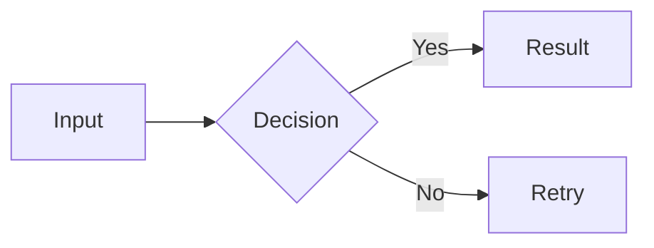

# Custom CSS for Marp Extended

Marp Extended has two CSS layers:

- Marp slide themes live in `vault/themes/` and install to `.marp-extended/themes/`.
- Mermaid themes live in `vault/mermaid-themes/` and install to `.marp-extended/mermaid-themes/`.

Choose a slide theme with the Marp `theme` property, and choose a Mermaid theme
with the `mermaidTheme` property.

## Basic Marp slide theme shape

A custom theme should start with Marp metadata and then define slide-level CSS:

```css
/* @theme my-theme */
/* @marp-extended-theme-version 4 */
@import "default";

:root {
  --slide-bg: #f5f4ed;
  --slide-text: #141413;
  --slide-accent: #1B365D;
  --slide-border: #e8e6dc;
}

section {
  background: var(--slide-bg);
  color: var(--slide-text);
  font-family: Charter, Georgia, serif;
  padding: 64px;
}

h1,
h2,
h3 {
  color: var(--slide-accent);
}
```

Use CSS variables for the palette when possible. That makes it easy to reuse the
same colors for headings, tables, code blocks, callouts, and diagram containers.

## Mermaid theme files

A Mermaid theme file is not a Marp theme. It should use Mermaid metadata:

```css
/* @mermaid-theme my-mermaid-theme */
/* @marp-extended-mermaid-theme-version 1 */
```

Then use it from slide frontmatter:

```yaml
---
marp: true
theme: kami
mermaidTheme: kami
mermaidFlat: true   # optional: remove the diagram card background
size: 16:9
paginate: true
---
```

Obsidian property suggestions for `mermaidTheme` are populated from installed
files in `.marp-extended/mermaid-themes/`.
Use `mermaidFlat: true` when the diagram should blend into the slide surface
instead of appearing on a separate card; suggestions for this property are
`true` and `false`.

## Mermaid output HTML
Marp Extended renders Mermaid fences with `beautiful-mermaid` as inline SVG:

```html
<figure class="mermaid-diagram-container mermaid-diagram mermaid-diagram-svg" data-mermaid-renderer="beautiful-mermaid">
  <svg>...</svg>
  <figcaption>Diagram title</figcaption>
</figure>
```

Theme CSS should style the outer container, the inline SVG, and the optional caption:

```css
/* Marp Extended Mermaid diagrams */
section .mermaid-diagram-container.mermaid-diagram {
  align-items: center;
  background: color-mix(in srgb, var(--slide-bg) 92%, white);
  border: 1px solid var(--slide-border);
  border-radius: 0.35em;
  box-shadow: 0 0.2em 0.8em rgba(27, 54, 93, 0.12);
  display: flex;
  flex-direction: column;
  gap: 0.35em;
  justify-content: center;
  margin: 0.75em auto 0;
  padding: 0.45em;
  max-width: calc(100% - 2em);
  width: fit-content;
}

section .mermaid-diagram-container.mermaid-diagram svg {
  display: block;
  height: auto;
  max-height: 430px;
  max-width: 100%;
  width: auto;
}

section .mermaid-diagram-container.mermaid-diagram figcaption {
  color: currentColor;
  font-size: 0.65em;
  line-height: 1.3;
  opacity: 0.72;
  text-align: center;
}
```

If you need maximum compatibility with older export environments, avoid
`color-mix()` and use explicit colors instead.

## Customizing Mermaid internals

Because Mermaid is now inline SVG, CSS can reach the generated shapes, text, and
the `beautiful-mermaid` CSS variables. Use the variables for theme palette
alignment, then add shape/text refinements as needed:

```css
section .mermaid-diagram-container.mermaid-diagram svg {
  --bg: var(--slide-bg) !important;
  --surface: color-mix(in srgb, var(--slide-bg) 94%, white) !important;
  --fg: var(--slide-text) !important;
  --line: var(--slide-muted, #504e49) !important;
  --accent: var(--slide-accent) !important;
  --muted: var(--slide-muted, #6b6a64) !important;
  --border: var(--slide-border) !important;
}

section .mermaid-diagram-container svg rect,
section .mermaid-diagram-container svg path,
section .mermaid-diagram-container svg polygon {
  stroke-width: 2px;
}

section .mermaid-diagram-container svg text {
  font-weight: 600;
}
```

The main diagram palette is still generated by the plugin through
`beautiful-mermaid` render options. The built-in defaults mirror the Kami palette:

```text
bg      #f5f4ed
surface #faf9f5
fg      #141413
line    #504e49
accent  #1B365D
muted   #6b6a64
border  #e8e6dc
```

Theme files should override these SVG variables with their own palette so nodes,
edges, arrowheads, labels, and group borders match the slide design. Use
`!important` because `beautiful-mermaid` writes default variables on the inline
SVG element. Prefer theme CSS over per-deck Mermaid init/style blocks so sample
decks stay clean.

## Recommended container recipes

### Light theme

```css
section .mermaid-diagram-container.mermaid-diagram {
  background: #f6f8fa;
  border: 1px solid #d0d7de;
  box-shadow: 0 0.2em 0.8em rgba(9, 105, 218, 0.12);
}
```

### Dark theme

```css
section .mermaid-diagram-container.mermaid-diagram {
  background: #44475a;
  border: 1px solid rgba(255, 121, 198, 0.26);
  box-shadow: 0 0.2em 0.8em rgba(255, 121, 198, 0.14);
}
```

### Minimal theme

```css
section .mermaid-diagram-container.mermaid-diagram {
  background: transparent;
  border: 0;
  border-radius: 0;
  box-shadow: none;
  padding: 0;
}
```

You can also keep a Mermaid theme's normal card styling and enable this per deck:

```yaml
---
mermaidTheme: kami
mermaidFlat: true
---
```

When enabled, Marp Extended injects a small override after the selected Mermaid
theme that makes the figure background transparent and removes its border,
shadow, and padding.

## Sizing guidance

By default, use intrinsic SVG width and only shrink oversized diagrams:

```css
section .mermaid-diagram-container.mermaid-diagram {
  width: fit-content;
  max-width: calc(100% - 2em);
}

section .mermaid-diagram-container.mermaid-diagram svg {
  width: auto;
  max-width: 100%;
  max-height: 430px;
  height: auto;
}
```

| Goal | Suggested CSS |
| --- | --- |
| Intrinsic centered diagram | container `width: fit-content; max-width: calc(100% - 2em);`, SVG `width: auto; max-width: 100%;` |
| Large architecture diagram | SVG `width: 96%; max-height: 500px;` |
| Small inline-ish diagram | `width: 60%; max-height: 320px;` |
| Full bleed diagram | remove container padding and use `width: 100%;` |

## Theme checklist

When adding or reviewing a custom theme, include:

- for Marp slide themes: `/* @theme name */` and base imports such as `@import "default";`
- for Mermaid themes: `/* @mermaid-theme name */` and `/* @marp-extended-mermaid-theme-version 1 */`
- section background/text/font rules
- heading colors
- code block colors
- table border/header colors if tables are used
- pagination/footer styling if `paginate: true` is expected
- `.mermaid-diagram-container.mermaid-diagram` styling
- `.mermaid-diagram-container.mermaid-diagram svg` sizing
- `.mermaid-diagram-container.mermaid-diagram figcaption` caption styling if you use fence alt text
- Mermaid SVG variable overrides: `--bg`, `--surface`, `--fg`, `--line`, `--accent`, `--muted`, `--border`
- optional inline SVG refinements for Mermaid shapes/text
- at least one Mermaid test slide in a sample deck

## Test slide

Use this slide to validate preview and export:

````markdown
---
marp: true
theme: my-theme
mermaidTheme: my-mermaid-theme
mermaidFlat: false
size: 16:9
paginate: true
---

# Mermaid theme check


````

Check that the diagram uses readable internal colors, has no stray left border,
uses its intrinsic width unless it would overflow the slide, and looks the same in preview and exported output.
