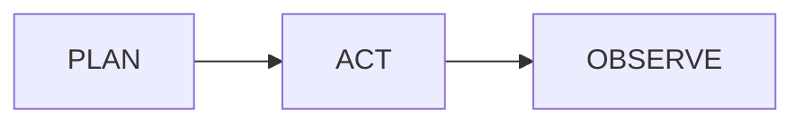

# Kami DSL

Kami DSL is a small Marp Extended authoring layer for Kami-style decks. It lets
you keep notes closer to Obsidian-friendly Markdown while the plugin compiles
layout hints into Marp-compatible directives and HTML before preview/export.

The regular Marp pipeline is still used: Marp Core renders preview, and Marp CLI
exports HTML/PDF/PPTX. Kami DSL only rewrites a few fenced blocks before that
happens.

Kami DSL layout blocks compile to HTML wrappers. To see those wrappers styled in
Obsidian preview, enable the plugin's **Enable HTML** setting. Export already
passes HTML through Marp CLI so these wrappers are preserved in exported files.

## Deck frontmatter stays Marp frontmatter

Use normal YAML frontmatter for deck-wide settings:

```yaml
---
marp: true
theme: kami-en
mermaidTheme: kami-en
mermaidFlat: true
size: kami
paginate: true
footer: "Kami · Marp Extended"
---
```

## Slide metadata

Use a `slide` fenced block for local Marp directives instead of HTML comments:

````md
```slide[]
class: cover
paginate: false
footer: ""
header: 01 · Origin
```
````

Marp Extended compiles it to current-slide spot directives:

```md
<!-- _class: cover -->
<!-- _paginate: false -->
<!-- _footer: "" -->
<!-- _header: 01 · Origin -->
```

Put the block near the top of the slide it controls.

## Semantic text blocks

These blocks compile to the existing Kami theme classes:

| DSL | Output class | Use |
| --- | --- | --- |
| ```` ```lead[] ```` | `lead` | Lead paragraph / large intro text |
| ```` ```sub[] ```` | `sub` | Cover subtitle |
| ```` ```meta[] ```` | `meta` | Cover metadata |
| ```` ```co[] ```` | `co` | Conclusion / callout |
| ```` ```note[] ```` | `co` | Alias for conclusion / callout |
| ```` ```mc[] ```` | `mc` | Mini callout |
| ```` ```callout[mc] ```` | custom | Custom callout class |

Example:

````md
```lead[]
Same palette, fonts, layout tokens. Only the editing posture changes.
```

```co[]
Title carries the claim. Body grounds it. The deck gains a spine.
```
````

## Columns

Use `cols` for two-column Kami layouts. Split columns with a line containing
only `===`:

````md
```cols[]
### Shared with Kami slides

- Warm parchment canvas
- Ink-blue accent
- Serif-led hierarchy

===

### What Marp Extended adds

- Obsidian preview
- Mermaid inline SVG
- PDF/PPTX/HTML export
```
````

Nested fenced blocks are allowed inside columns, including `mermaid`, `lead`,
`mc`, and code fences:

````md
```cols[]
```lead[]
Tools should match Agent goals, not underlying API shapes.
```

===


```
````

## 2×2 cards

Use `cards[2x2]` for metric-card layouts. Split cards with `===`:

````md
```cards[2x2]
### A · Palette
One ink-blue accent, never above 5% of surface area.

===

### B · Type
One serif per page. Body 400, headings 500.

===

### C · Layout
Two-column content uses the Kami grid.

===

### D · Rhythm
Spacing follows theme rhythm tokens.
```
````

The heading pattern `Label · Title` becomes the existing Kami metric title:

```html
<div class="mt"><span class="ml">A</span>Palette</div>
```

## Mermaid attributes

Mermaid fences keep the existing title syntax:

````md

````

You can also put title-like attributes in `[]`:

````md

````

Currently `title` / `alt` are used as the rendered figure caption. Other
attributes are reserved for future DSL expansion.

## What still belongs in standard Markdown

Use standard Markdown where it already works well:

- headings
- paragraphs
- lists
- code fences
- Markdown tables for data tables
- standard Markdown images
- Obsidian image wiki-links such as `![[diagram.png|600]]`

Kami DSL is for slide metadata and layout wrappers, not for replacing regular
Markdown.

## Implementation notes

Preview and export both run the same compiler before Marp rendering. Source
notes are not modified by export; compiled content is written to temporary
Markdown when needed.

Because the compiler emits HTML for layout wrappers, Obsidian preview requires
the plugin's **Enable HTML** setting for `lead`, `cols`, `cards`, and similar
blocks to render as styled Kami layout. `slide` metadata compiles to Marp
directives and does not depend on HTML rendering.

The compiler intentionally stays small. If a layout is not covered by the DSL,
raw HTML remains an escape hatch, but prefer adding a focused fenced block when
the pattern is reusable across Kami decks.
