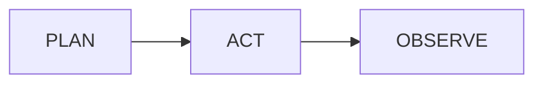
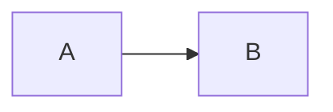

# Kami DSL

Kami DSL is a small Marp Extended authoring layer for Kami-style decks. It lets
you keep notes close to Obsidian-friendly Markdown while the plugin compiles
comment-marker layout hints into Marp-compatible directives and HTML before
preview/export.

The regular Marp pipeline is still used: Marp Core renders preview, and Marp CLI
exports HTML/PDF/PPTX. Kami DSL only rewrites namespaced `%%marp-*%%` marker
lines before that happens.

Kami DSL layout blocks compile to HTML wrappers. To see those wrappers styled in
Obsidian preview, enable the plugin's **Enable HTML** setting. Export already
passes HTML through Marp CLI so these wrappers are preserved in exported files.

Marker lines are complete Obsidian comments and are hidden by Obsidian Reading
view. Content between paired markers remains normal Markdown and still renders in
Obsidian.

## Deck frontmatter stays Marp frontmatter

Use normal YAML frontmatter for deck-wide settings:

```yaml
---
marp: true
theme: kami-en
mermaidTheme: kami-en
mermaidFlat: true
size: kami
paginate: true
footer: "Kami · Marp Extended"
---
```

## Slide metadata

Use a single `%%marp-slide[...]%%` marker for local Marp directives instead of
visible HTML comments:

```md
%%marp-slide[class=cover paginate=false footer="" header="01 · Origin"]%%
```

Marp Extended compiles it to current-slide spot directives:

```md
<!-- _class: cover -->
<!-- _paginate: false -->
<!-- _footer: "" -->
<!-- _header: 01 · Origin -->
```

Put the marker near the top of the slide it controls. Values containing spaces
must be quoted.

## Semantic text blocks

These paired markers compile to the existing Kami theme classes:

| DSL marker | Output class | Use |
| --- | --- | --- |
| `%%marp-lead%%` | `lead` | Lead paragraph / large intro text |
| `%%marp-sub%%` | `sub` | Cover subtitle |
| `%%marp-meta%%` | `meta` | Cover metadata |
| `%%marp-co%%` | `co` | Conclusion / callout |
| `%%marp-note%%` | `co` | Alias for conclusion / callout |
| `%%marp-mc%%` | `mc` | Mini callout |
| `%%marp-callout[mc]%%` | custom | Custom callout class |

Example:

```md
%%marp-lead%%
Same palette, fonts, layout tokens. Only the editing posture changes.
%%/marp-lead%%

%%marp-co%%
Title carries the claim. Body grounds it. The deck gains a spine.
%%/marp-co%%
```

## Columns

Use `%%marp-cols%%` for two-column Kami layouts. Split columns with the hidden
`%%marp-col%%` marker line:

````md
%%marp-cols%%
### Shared with Kami slides

- Warm parchment canvas
- Ink-blue accent
- Serif-led hierarchy

%%marp-col%%

### What Marp Extended adds

- Obsidian preview
- Mermaid inline SVG
- PDF/PPTX/HTML export
%%/marp-cols%%
````

Nested Markdown is allowed inside columns, including Mermaid fences and other
Kami comment-marker blocks:

````md
%%marp-cols%%
%%marp-lead%%
Tools should match Agent goals, not underlying API shapes.
%%/marp-lead%%

%%marp-col%%


```mermaid[Agent loop]
flowchart LR
  P[PLAN] --> A[ACT]
  A --> O[OBSERVE]
```
%%/marp-cols%%
````

## 2×2 cards

Use `%%marp-cards[2x2]%%` for metric-card layouts. Split cards with the hidden
`%%marp-card%%` marker line:

```md
%%marp-cards[2x2]%%
### A · Palette
One ink-blue accent, never above 5% of surface area.

%%marp-card%%

### B · Type
One serif per page. Body 400, headings 500.

%%marp-card%%

### C · Layout
Two-column content uses the Kami grid.

%%marp-card%%

### D · Rhythm
Spacing follows theme rhythm tokens.
%%/marp-cards%%
```

The heading pattern `Label · Title` becomes the existing Kami metric title:

```html
<div class="mt"><span class="ml">A</span>Palette</div>
```

## Mermaid attributes

Mermaid is the only DSL-adjacent block that remains a standard fenced code block
to preserve Obsidian's native code-block syntax:

````md

```mermaid[Kami Mermaid]
flowchart LR
  A --> B
```
````

You can also put title-like attributes in `[]`:

````md

```mermaid[title="Kami Mermaid" theme=kami]
flowchart LR
  A --> B
```
````

Currently `title` / `alt` are used as the rendered figure caption. Other
attributes are reserved for future DSL expansion.

## What still belongs in standard Markdown

Use standard Markdown where it already works well:

- headings
- paragraphs
- lists
- code fences
- Markdown tables for data tables
- standard Markdown images
- Obsidian image wiki-links such as `![[diagram.png|600]]`

Kami DSL is for slide metadata and layout wrappers, not for replacing regular
Markdown.

## Implementation notes

Preview and export both run the same comment-marker compiler before Marp
rendering. Source notes are not modified by export; compiled content is written
to temporary Markdown when needed.

Because the compiler emits HTML for layout wrappers, Obsidian preview requires
the plugin's **Enable HTML** setting for `lead`, `cols`, `cards`, and similar
blocks to render as styled Kami layout. `%%marp-slide[...]%%` metadata compiles
to Marp directives and does not depend on HTML rendering.

The compiler intentionally stays small. If a layout is not covered by the DSL,
raw HTML remains an escape hatch, but prefer adding a focused comment-marker
block when the pattern is reusable across Kami decks.
