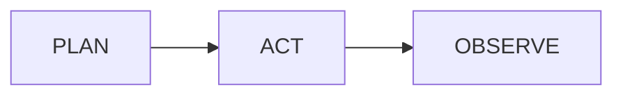

# Obsidian Marp

Use this skill to help agents author Marp slide decks that work in **Marp Extended**, this repository's Obsidian plugin (`manifest.json` id: `marp-extended`).

Current project metadata: **Marp Extended** package `0.10.0-beta.1`
(`package.json`; stable Community `manifest.json` stays on the latest published
stable until the next Community release), plugin/package id `marp-extended`,
repository <https://github.com/shuuul/obsidian-marp-extended>.

Runtime stack (2026-08):

- **Preview:** `@marp-team/marp-core` `5.0.1` (npm `next` channel) with curated **Shiki** + **MathJax** plugins and the custom Mermaid stack.
- **Export:** exactly Marp CLI `4.5.0` as host, always given Marp Extended's shipped Core 5 engine through `--engine`. The optional npx path is pinned to `@marp-team/marp-cli@4.5.0`.
- **Math:** MathJax only in this plugin build. Do **not** recommend `math: katex` for Marp Extended preview.
- **Code highlight:** Shiki with a **curated language subset** (`src/shims/marp-shiki.cjs`). Theme colors via `--marp-shiki-*`, not `.hljs-*`.
- **Themes:** packaged sources under `assets/themes/` and `assets/mermaid-themes/`; installed to vault `.marp-extended/themes/` and `.marp-extended/mermaid-themes/`.
- **Slides:** Marpit Markdown (ruler split + directives + image syntax + fragmented lists) with Marp Core extras (size, emoji/Twemoji, fitting header, GFM, loose YAML, inline SVG).

## Start here

1. Read `docs/marp-extended-syntax.md` first for the canonical, user-facing Extended marker language.
2. Read `references/syntax.md` for the wider Marpit base syntax, directives, images, fragments, Marp Core extras, and the **language style** table for this plugin.
3. Read `references/plugin-adapter.md` before advising on plugin behavior: wiki-links, themes, Mermaid, export options, and local-file handling differ from generic Marp CLI docs.
4. Read `references/SOURCES.md` for upstream links or to refresh the downloaded reference bundle.
5. Run `scripts/update-references.py` from the repo root to refresh `references/upstream/` from official sources.

## Language style (keep decks Obsidian-readable)

Official Marpit goal: decks should still look fine in a normal Markdown editor.
Marp Extended strengthens that for Obsidian.

| Prefer | Default away from |
| --- | --- |
| YAML frontmatter for deck settings | Repeated global HTML comment directives |
| `%%marp-slide[...]%%` for spot slide metadata | Visible `<!-- _class: ... -->` when the Extended marker is clearer |
| Marp Extended `%%marp-*%%` layout blocks | Large hand-rolled HTML trees |
| Obsidian `![[image\|600]]` wiki-links | Absolute filesystem image paths |
| `math: mathjax` / omit | `math: katex` |
| Curated Shiki fence tags + optional `{lines}` | highlight.js / `.hljs-*` theme rules |
| Marpit `` / filters when needed | Assuming wiki-links encode `bg`/filters (they do not) |

## Authoring rules for this plugin

- Put `marp: true` in YAML frontmatter when creating decks for editor integrations.
- Split slides with a horizontal rule (`---`, `___`, `***`, or `- - -`). Blank line before `---` when CommonMark needs it. Do not confuse the closing frontmatter `---` with a slide separator.
- Prefer `headingDivider` when converting a plain note into slides without littering rulers.
- Prefer deck frontmatter plus Marp Extended `%%marp-*%%` comment-marker blocks over raw HTML/CSS where possible.
- Treat `docs/marp-extended-syntax.md` as the product source of truth for canonical markers, generated classes, and nesting rules.
- Use `%%marp-slide[...]%%`, `%%marp-lead%%`, `%%marp-subtitle%%`, `%%marp-metadata%%`, `%%marp-callout[variant=...]%%`, `%%marp-columns%%`, and `%%marp-cards[columns=N]%%`. Split columns/cards with `%%marp-column%%` / `%%marp-card%%`.
- Local directives apply forward; prefix `_` for current-slide-only spot directives. `paginate` accepts `true` / `false` / `hold` / `skip`.
- Use Obsidian image wiki-links for images: `![[diagram.png]]`, `![[diagram.png|Alt text]]`, `![[diagram.png|600]]`, and `![[diagram.png|600x400]]`. Size aliases become Marp image directives such as `![w:600]` and `![w:600 h:400]`.
- For backgrounds, split layouts, and filters, use Marpit image syntax (``, ``). Advanced multi/split backgrounds need inline SVG (enabled in this plugin).
- Fragmented lists: bullets with `*`, ordered with `1)`. Regular lists use `-`/`+` and `1.`. The plugin preview toolbar/commands step, reverse, and reset fragments for the active slide.
- Fitting headers (theme must support `@auto-scaling`): `# <!-- fit --> Title`.
- For predictable export, keep local images and theme CSS inside the vault. Export uses Marp CLI with `--allow-local-files`.
- Themes: Marp Core built-ins `default`, `gaia`, `uncover`, plus packaged custom `kami`. Kami uses Chinese typography by default and English typography with `lang: en`. Add more via vault CSS with `/* @theme name */`. Kami sizes: `kami`, `portfolio`.
- For math, use `math: mathjax` (or omit; MathJax is the plugin default). **KaTeX is not bundled** in Marp Extended preview.
- For diagrams, Mermaid fences render as inline SVG via `beautiful-mermaid` (with official Mermaid fallback for unsupported diagram types). Style with `mermaidTheme` / `mermaidFlat`. Caption via ` ```mermaid[Title] `. The same rendering is used in Live Preview and Reading view; Reading view has no show-source button.
- For code fences, prefer languages in the curated Shiki subset (e.g. `python`, `ts`/`typescript`, `rust`, `js`, `json`, `yaml`, `bash`/`shellscript`, `go`, `sql`). Unsupported languages fall back to plain text. Line highlight: ` ```ts {1,3-4} `.
- Theme authors: style syntax highlighting with `--marp-shiki-*` on `section`. Kami code blocks use ivory fill, soft border, mono ~10pt, `width: fit-content; max-width: 100%`.
- Keep example frontmatter explicit: include `marp`, `theme`, `mermaidTheme`, `mermaidFlat`, `size`, and `paginate`.

## Common deck skeleton

````markdown
---
marp: true
theme: kami
lang: en
mermaidTheme: kami
mermaidFlat: true
size: kami
paginate: true
math: mathjax
---

# Title

%%marp-slide[class=cover paginate=false]%%

%%marp-subtitle%%
Subtitle for the cover
%%/marp-subtitle%%

%%marp-metadata%%
Team · 2026
%%/marp-metadata%%

---

## Image from Obsidian vault

![[attachments/example.png|Example image]]


Content stays on the left when using split backgrounds.

---

## Fragments and code

* First point
* Second point

```ts {1,3}
const ok: boolean = true;
const skip = 0;
const also = true;
```

---

## Diagram



---

## Presenter notes

Main slide content.

<!--
These notes appear in the plugin preview notes panel, labeled by slide number, and can be exported with PDF notes. Drag the top edge of the panel to resize it.
-->
````

## Update references

Refresh official docs snapshots after Marp / Marpit / Marp CLI upgrades:

```bash
python3 skills/obsidian-marp/scripts/update-references.py
```

The script only updates generated upstream snapshots and source indexes. Keep the hand-written plugin adaptation notes in `references/syntax.md` and `references/plugin-adapter.md` aligned with this repository's code.
