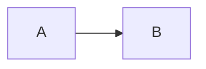
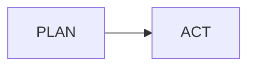

# Marp / Marpit syntax reference for Marp Extended

Agent-facing syntax guide for writing Marp decks in this plugin. Prefer this file
over raw upstream dumps when authoring. Upstream snapshots live in `upstream/`;
plugin-only behavior lives in `plugin-adapter.md`.

## Language style for agents

Write decks so they stay readable in Obsidian Reading view **and** render correctly
in Marp Extended preview/export.

| Layer | Prefer | Avoid as default |
| --- | --- | --- |
| Deck metadata | YAML frontmatter | Repeated global HTML comments |
| Slide metadata | `%%marp-slide[...]%%` | Visible `<!-- _class: ... -->` when the Extended marker is clearer |
| Layout | Marp Extended `%%marp-*%%` blocks, then small HTML | Large hand-rolled HTML trees |
| Images | Obsidian `![[...]]` wiki-links | Hard-coded absolute disk paths |
| Math | `math: mathjax` / omit | `math: katex` |
| Diagrams | ` ```mermaid ` fences (+ plugin Mermaid stack) | Assuming Core mermaid plugin options |
| Code | Curated Shiki langs + optional `{line}` highlight | highlight.js / `.hljs-*` theme rules |

Rules of thumb:

1. Keep CommonMark-compatible structure first (headings, lists, fences, images).
2. Use Marpit extensions only where Markdown alone cannot express the slide.
3. Prefer canonical Marp Extended markers for reusable layouts regardless of theme.

## Minimal deck

```markdown
---
marp: true
theme: default
paginate: true
---

# Slide 1

Content

---

## Slide 2

More content
```

- `marp: true` is common for editor integrations; include it in Obsidian notes meant as decks.
- YAML frontmatter must be the **first** thing in the file. The closing `---` ends metadata; the first slide starts after it.
- Do not confuse the frontmatter closing `---` with a slide separator.

## How slides split (Marpit Markdown)

Marpit splits pages on horizontal rulers. Official Marpit goal: decks still look
like normal Markdown in a general editor.

```markdown
# Slide 1

foo

---

# Slide 2

bar
```

Supported rulers:

| Ruler | Notes |
| --- | --- |
| `---` | Most common. CommonMark may require a blank line before it. |
| `___` | Underline ruler; useful when you cannot add a blank line. |
| `***` | Asterisk ruler. |
| `- - -` | Space-included dash ruler. |

Authoring tips:

- Put a blank line before `---` when in doubt (CommonMark thematic-break rules).
- After YAML frontmatter, the next `---` is a **slide** break, not more frontmatter.
- For plain-Markdown-friendly decks, prefer `headingDivider` over many manual rulers.

## Directives

Directives are YAML key/value settings in frontmatter or HTML comments.

### Writing form

HTML comment:

```markdown
<!--
theme: default
paginate: true
-->
```

Front-matter (preferred for deck-wide settings):

```markdown
---
theme: default
paginate: true
---
```

YAML rules that matter in practice:

- Values with special YAML characters need quotes: `header: '**Draft** · v0.3'`.
- Marp Core enables **loose YAML** parsing by default; still quote when unsure.
- HTML comments that parse as directives are **not** collected as presenter notes.
- Same global directive repeated → Marpit keeps the **last** value.

### Global directives

Affect the whole deck.

| Directive | Scope | Use |
| --- | --- | --- |
| `theme` | Marpit | Theme registered in the theme set (`default`, `gaia`, `uncover`, or vault CSS theme). |
| `style` | Marpit | CSS tweaks as a YAML block scalar. Prefer over raw `<style>` when editing in Obsidian. |
| `headingDivider` | Marpit | Auto-split before headings. Number `1`–`6` or array like `[1, 2]`. |
| `lang` | Marpit | HTML `lang` on each slide. |
| `size` | Marp Core | Size preset from the current theme. Built-ins: `16:9`, `4:3`. Packaged Kami themes also define `kami` (and sometimes `portfolio`). |
| `math` | Marp Core | Math engine. **Marp Extended preview: `mathjax` only.** |
| `mermaidTheme` | Marp Extended | Mermaid-only CSS theme from `.marp-extended/mermaid-themes`. |
| `mermaidFlat` | Marp Extended | `true` removes Mermaid figure card chrome so diagrams blend into the slide. |
| `title`, `author`, `keywords`, `url`, `image` | Marp CLI | Export metadata for HTML/PDF/PPTX where supported. |
| `marp` | Editor convention | `true` marks the note as a Marp deck for integrations. |

Example:

```yaml
---
marp: true
theme: gaia
mermaidTheme: kami
mermaidFlat: false
size: 16:9
headingDivider: 2
math: mathjax
style: |
  section {
    letter-spacing: 0.01em;
  }
---
```

#### `headingDivider` detail

Number `N` splits before headings of level **≥ N**. Array splits only listed levels.

These two decks produce the same page breaks:

```markdown
# 1st page

body

---

## 2nd page

### still on 2nd

---

# 3rd page
```

```markdown
<!-- headingDivider: 2 -->

# 1st page

body

## 2nd page

### still on 2nd

# 3rd page
```

Useful when converting a normal note into slides without littering `---` rulers.

### Local directives

Apply to the **current slide and following slides**. Prefix with `_` for a
**spot directive** (current slide only).

| Directive | Use |
| --- | --- |
| `paginate` | `true`, `false`, `hold`, or `skip`. Show and/or increment page numbers. |
| `header`, `footer` | Repeated header/footer content. Markdown + inline images OK; `![bg]` not OK. |
| `class` | Classes on the slide `<section>`, e.g. `_class: lead` or `_class: cover`. |
| `backgroundColor` / `backgroundImage` | Slide background CSS. |
| `backgroundPosition` | Default `center`. |
| `backgroundRepeat` | Default `no-repeat`. |
| `backgroundSize` | Default `cover`. |
| `color` | Slide text color. |
| `transition` | Marp CLI bespoke transition to the next slide boundary. |

HTML comment examples:

```markdown
<!-- _class: lead -->
<!-- paginate: hold -->
<!-- backgroundColor: "#111" -->
<!-- color: "#eee" -->
```

Spot vs following:

```markdown
<!-- backgroundColor: aqua -->

This page is aqua.

---

This page is still aqua.

---

<!-- _backgroundColor: black -->
<!-- _color: white -->

Only this page is black on white.

---

Back to aqua.
```

#### Pagination matrix

| `paginate` | Page number visible | Page number increments |
| --- | --- | --- |
| `true` | Yes | Yes |
| `false` | No | Yes |
| `hold` | Yes | No |
| `skip` | No | No |

Common title-slide patterns:

```markdown
# Title

No paginate directive yet → no page number.

---

<!-- paginate: true -->

Numbering starts here (often as page 2).
```

```yaml
---
paginate: true
_paginate: false   # or _paginate: skip
---
```

#### Header / footer formatting

```yaml
---
header: '**bold** _italic_'
footer: ''
---
```

- Quote values so YAML stays valid.
- Themes must position `header` / `footer` if you want PowerPoint-like margins.
- `![bg]` image syntax does **not** work inside header/footer (parse order).

### Marp Extended slide marker

Prefer the Obsidian-friendly marker over raw HTML comments for spot directives:

```markdown
%%marp-slide[class=cover paginate=false footer="" header="01 · Origin"]%%
```

Compiles to:

```markdown
<!-- _class: cover -->
<!-- _paginate: false -->
<!-- _footer: "" -->
<!-- _header: 01 · Origin -->
```

- Place the marker near the top of the slide it controls.
- Quote `key=value` attributes when values contain spaces.
- Keys are always emitted as spot directives (`_key`) unless already prefixed.

## Marp Extended comment markers

The Extended language is a small compile step before the shared Marp Core 5
engine. Marker lines are complete Obsidian comments (hidden in Reading view).
Content between paired markers stays normal Markdown. HTML is always enabled for
generated wrappers; there is no separate HTML setting.

| Marker | Compiles to |
| --- | --- |
| `%%marp-slide[...]%%` | Marp local spot directives (`<!-- _key: value -->`). |
| `%%marp-lead%%` | `marp-extended-lead` wrapper. |
| `%%marp-subtitle%%` | `marp-extended-subtitle` wrapper. |
| `%%marp-metadata%%` | `marp-extended-metadata` wrapper. |
| `%%marp-callout[variant=co]%%` | `marp-extended-callout marp-extended-callout-co` wrapper. |
| `%%marp-callout[variant=mc]%%` | `marp-extended-callout marp-extended-callout-mc` wrapper. |
| `%%marp-columns%%` | 1–6 column grid, split by `%%marp-column%%`. |
| `%%marp-cards[columns=N]%%` | 1–6-column metric-card table, split by `%%marp-card%%`. |

Examples:

````markdown
%%marp-lead%%
Same palette, fonts, layout tokens. Only the editing posture changes.
%%/marp-lead%%

%%marp-columns%%
### Left column

- Markdown content

%%marp-column%%

### Right column


%%/marp-columns%%

%%marp-cards[columns=2]%%
### A · Palette
One ink-blue accent.

%%marp-card%%

### B · Type
One serif per page.
%%/marp-cards%%
````

Card headings of the form `Label · Title` become namespaced metric titles:

```html
<div class="marp-extended-card-title"><span class="marp-extended-card-label">A</span>Palette</div>
```

Hand-written HTML remains an escape hatch:

```markdown
<div class="marp-extended-columns marp-extended-columns-2">
<div class="marp-extended-column">

### Left column

- Markdown still works inside the HTML wrapper.

</div>
<div class="marp-extended-column">

<div class="marp-extended-callout marp-extended-callout-mc">A styled callout controlled by the theme CSS.</div>

</div>
</div>
```

Keep HTML semantic and small. Put reusable styling in theme CSS, not repeated
`style="..."` attributes. See `docs/marp-extended-syntax.md` for the user-facing language
contract.

## Images (Marpit extended ``)

Standard Markdown images work:

```markdown

```

Marpit extends the **alt text** with keywords. Remaining alt text becomes the
real alt (inline) or caption (backgrounds).

### Capability matrix

| Feature | Inline image | Basic `![bg]` | Advanced BG (inline SVG) |
| --- | --- | --- | --- |
| Resize by length (`w`/`h`) | Yes | Yes | Yes |
| Resize by `%` | No | Yes | Yes |
| Resize keyword (`cover`…) | `auto` only | Yes | Yes |
| CSS filters | Yes | No | Yes |
| Multiple backgrounds | — | No (last wins) | Yes |
| Split backgrounds | — | No | Yes |

Marp Extended preview enables **inline SVG slides**, so advanced backgrounds work
in preview. Export HTML/PDF paths also go through Marp with SVG slides enabled in
normal plugin use.

### Inline sizing

```markdown


```

- `w` / `h` shorthand `width` / `height`.
- Inline images allow CSS absolute lengths and `auto`.
- Viewport units (`vw`, `vh`, `vmin`, `vmax`) are rejected for stable rendering.

### Filters (inline + advanced backgrounds)

```markdown


```

| Keyword | Example with args |
| --- | --- |
| `blur` | `blur:10px` |
| `brightness` | `brightness:1.5` |
| `contrast` | `contrast:200%` |
| `drop-shadow` | `drop-shadow:0,5px,10px,rgba(0,0,0,.4)` |
| `grayscale` | `grayscale:1` |
| `hue-rotate` | `hue-rotate:180deg` |
| `invert` | `invert:100%` |
| `opacity` | `opacity:.5` |
| `saturate` | `saturate:2.0` |
| `sepia` | `sepia:1.0` |

Omitting args uses Marpit defaults. Multiple filters may combine.

### Slide backgrounds

```markdown


```

| Keyword | Meaning |
| --- | --- |
| `cover` | Fill slide (default). |
| `contain` | Fit entire image. |
| `fit` | Alias of `contain` (Deckset-compatible). |
| `auto` | Original size. |
| `x%` | Scale factor. |

### Advanced backgrounds (inline SVG)

Multiple backgrounds arrange in a row (or column with `vertical`):

```markdown


```

Split backgrounds shrink content to the opposite side:

```markdown


# Content on the right
```

```markdown


# Content on the left (60%)
```

```markdown


# Split + multiple BGs on the image side
```

- `left` / `right` / `left:33%` / `right:40%` are the split forms.
- Mixed `left` and `right` on one slide → last defined side wins.
- Filters work on advanced backgrounds; they do **not** apply to basic single `![bg]` mode.

### Color / gradient backgrounds via directives

When you need CSS instead of an image file:

```markdown
<!-- backgroundImage: "linear-gradient(to bottom, #67b8e3, #0288d1)" -->

Gradient page

---

<!--
_backgroundColor: black
_color: white
-->

Black page, white text
```

### Obsidian image wiki-links (this plugin)

Marp Extended converts image wiki-links before render/export:

```markdown
![[attachments/diagram.png]]
![[diagram.png|System diagram]]
![[diagram.png|600]]
![[diagram.png|600x400]]
```

| Wiki-link | Converted form |
| --- | --- |
| `![[image.png]]` | `` |
| `![[image.png\|Alt text]]` | `` |
| `![[image.png\|600]]` | `` |
| `![[image.png\|600x400]]` | `` |

Constraints:

- Only image extensions: `png`, `jpg`, `jpeg`, `gif`, `svg`, `webp`, `bmp`.
- Unresolved links still emit a Markdown image using the wiki target as the path.
- Non-image embeds are out of scope.
- For predictable export, keep images inside the vault (`--allow-local-files`).

Wiki-links do **not** currently express `bg` / filters. For backgrounds and filters,
use converted Markdown image syntax after a normal path, or a standard `` image:

```markdown


```

## Lists and fragments

Regular lists:

```markdown
- One
- Two

1. One
2. Two
```

Fragmented lists (appear one-by-one in supporting viewers):

```markdown
* First appears
* Then this
* Then this

1) First
2) Second
3) Third
```

| List kind | Regular marker | Fragment marker |
| --- | --- | --- |
| Bullet | `-` or `+` | `*` |
| Ordered | `1.` | `1)` |

Rendering notes:

- HTML structure matches normal lists; items get `data-marpit-fragment="N"`.
- The slide `<section>` gets `data-marpit-fragments` with the fragment count.
- The plugin preview tracks each logical slide independently and exposes previous, next, and reset fragment controls plus keyboard-bindable commands. Fragments start fully revealed so the preview matches export; use reset to rewind before stepping.
- Marp CLI **bespoke** HTML has its own fragment runtime for exported presentations.

## Presenter notes

HTML comments that are **not** directives become presenter notes:

```markdown
# Public slide

<!--
Private presenter notes.
Multi-line is fine.
-->
```

- Directive comments are excluded from notes collection.
- The plugin preview maps comments to logical slides and shows them as literal text in a toggleable notes panel.
- `%%marp-callout[variant=note]%%` is a visible block and is not presenter-note syntax.
- Plugin "PDF with notes" export uses Marp CLI `--pdf-notes` and `--pdf-outlines`.

## Math (Marp Core + this plugin)

Pandoc-style math:

```markdown
Inline: $E = mc^2$.

$$
\int_0^1 x^2 \, dx = \frac{1}{3}
$$
```

```yaml
math: mathjax
```

| Engine | Marp Core | Marp Extended preview | Advice |
| --- | --- | --- | --- |
| MathJax | Yes (plugin) | **Yes (only)** | Prefer / default |
| KaTeX | Yes (plugin) | **No** | Do not use here |

Declare `math: mathjax` when a deck uses math so export tooling stays explicit.
KaTeX block auto-scaling from Core docs does not apply to this plugin build.

## Code highlighting (Shiki)

Preview uses Marp Core **Shiki** with a curated language subset
(`src/shims/marp-shiki.cjs`). Unsupported langs fall back to plain text.

Prefer common tags:

`python`, `js`/`javascript`, `ts`/`typescript`, `tsx`, `jsx`, `rust`, `go`,
`c`, `cpp`, `java`, `json`, `yaml`, `toml`, `bash`/`shellscript`, `sql`,
`html`, `css`, `markdown`, `diff`, `docker`, `terraform`, …

```markdown
```ts
const ok: boolean = true;
```
```

### Line highlighting

Marp Core Shiki accepts a space-separated `{...}` attribute after the language:

````markdown
```ts {1,3-4}
const a = 1;
const b = 2;
const c = 3;
const d = 4;
```
````

Theme colors use CSS variables on `section`, not highlight.js classes:

- `--marp-shiki-foreground`
- `--marp-shiki-background`
- `--marp-shiki-line-highlight`
- `--marp-shiki-token-*`

Kami code chrome (theme CSS): ivory fill, soft border, mono ~10pt,
`width: fit-content; max-width: 100%`.

## Mermaid diagrams (this plugin)

Marp Extended does **not** use Core's mermaid plugin. It pre-renders fences with
`beautiful-mermaid` (official Mermaid fallback for unsupported types).

````markdown

````

Title / caption attributes (plugin DSL-adjacent):

````markdown



````

| Attribute | Effect today |
| --- | --- |
| positional / `title` / `alt` | Figure caption |
| other keys | Reserved |

Related frontmatter: `mermaidTheme`, `mermaidFlat`.

To show source instead of a diagram in generic Marp Core docs one might use
`mermaid-raw` / `mmd`; this plugin's path is fence pre-render — prefer normal
`mermaid` fences and theme frontmatter here.

## Marp Core Markdown defaults

On top of Marpit, Marp Core changes defaults agents should expect:

| Area | Behavior |
| --- | --- |
| Inline SVG slides | Enabled (advanced backgrounds + auto-scaling depend on this). |
| Loose YAML | Enabled for directives. |
| GFM | Tables and strikethrough supported. |
| Soft line breaks | Newlines inside a paragraph become `<br>` by default. |
| Heading IDs | GitHub-like slug IDs. |
| HTML | Only known-safe elements/attributes by default. `<style>` and directive comments still work. |
| Emoji | `:smile:` shortcodes and Unicode emoji can become Twemoji SVGs. |
| Built-in themes | `default`, `gaia`, `uncover`. |
| Built-in sizes | `16:9` (1280×720), `4:3` (960×720) on official themes. |

### Fitting header / auto-scaling

When the theme enables `@auto-scaling` (built-in themes do), headings can scale
to slide width with a hidden fit marker:

```markdown
# <!-- fit --> Fitting header
```

Notes:

- Works for `#` … `######`.
- Auto-scaling is horizontal only; content can still overflow vertically.
- Disabled if inline SVG is off.
- Code blocks may auto-shrink when the theme enables that feature.
- Custom themes need `@auto-scaling` metadata; do not assume Kami themes mirror every built-in auto-scale rule — verify in preview.

### Scoped style tweaks

Small per-deck or per-slide CSS:

```markdown
---
style: |
  section {
    font-size: 32px;
  }
---

<style scoped>
section {
  color: #333;
}
</style>
```

Prefer `style: |` in frontmatter for deck-wide tweaks so Obsidian Reading view
stays cleaner. Use full theme CSS files for reusable design systems.

## Themes

Minimal custom theme:

```css
/* @theme obsidian-example */

section {
  width: 1280px;
  height: 720px;
  font-size: 34px;
  padding: 56px;
  background: #111827;
  color: #f9fafb;
}

section.lead {
  display: grid;
  place-content: center;
  text-align: center;
}

section::after {
  color: #9ca3af;
}
```

Rules:

- `/* @theme name */` is required.
- Style slides via `section` or `:root`. In Marpit theme CSS, `:root` means each slide section, not the document root. `:root` wins specificity over `section`.
- `rem` is relative to the slide section font size after Marpit processing.
- `section::after` styles pagination. Custom `content` must still include `attr(data-marpit-pagination)` or Marpit ignores it.
- Header/footer elements have **no** default theme positioning.
- Slide size is **one size per theme definition / selected preset**, using static absolute units: `px`, `cm`, `in`, `mm`, `pc`, `pt`, `Q`.
- Define extra presets with `/* @size name width height */` (Kami ships `kami` and `portfolio`).
- Import another registered theme with `@import 'default';` or `@import-theme 'default';`.
- Out of the box: Marp Core built-ins `default`, `gaia`, `uncover`, plus packaged custom `kami`. Kami uses Chinese typography by default and English typography with `lang: en`. Add more via vault CSS.

## Transitions (HTML / bespoke export)

Marp CLI bespoke template:

```yaml
transition: fade
transition: slide 750ms
```

```markdown
<!-- _transition: cover -->
```

- Applies to the **next** slide boundary.
- `_transition` limits to one boundary.
- Built-ins include `none`, `fade`, `slide`, `cover`, `push`, `reveal`, `wipe`, `zoom`, `flip`, `cube`, and others.
- Needs View Transition API support in the browser.
- Relevant mainly to HTML/bespoke presentations, not PDF/PPTX.

## Export implications in Marp Extended

| Plugin export | CLI flags (shape) |
| --- | --- |
| PDF | `--pdf -o deck.pdf` |
| PDF with notes | `--pdf --pdf-notes --pdf-outlines -o deck.pdf` |
| PPTX | `--pptx -o deck.pptx` |
| HTML | `--html --template <bare\|bespoke> -o deck.html` |

Also added by the plugin:

- `--allow-local-files`
- `--html` (preserve pre-rendered Mermaid SVG / Kami HTML)
- `--engine <absolute plugin path>/marp-engine.cjs` (shipped Core 5 engine)
- optional `--theme-set <vault .marp-extended/themes>`
- optional `--browser-path <CHROME_PATH>`
- engine wiring for export path

Runtime boundary to remember when advising users:

| Surface | Engine |
| --- | --- |
| In-Obsidian preview | Shared Marp Core **5** factory + Shiki + MathJax + custom Mermaid |
| Managed export | Marp CLI **4.5.0** host + the same shipped Core **5** semantic engine |

Containers, templates, browser layout, PDF, and PPTX remain host-owned, so parity
is semantic rather than pixel-identical.

## Authoring checklist

1. Frontmatter: `marp`, `theme`, `size`, `paginate`, and Mermaid keys when needed.
2. Split slides with rulers or `headingDivider`; never confuse frontmatter `---`.
3. Spot layout/class via `%%marp-slide[...]%%` or `_class`.
4. Images via `![[file|size]]` or Marpit `` / filters.
5. Use standard fragments (`*` / `1)`); test the plugin controls and the target export viewer.
6. Math with MathJax syntax only.
7. Code fences in the curated Shiki set; add `{lines}` when highlighting matters.
8. Extended layouts through canonical `%%marp-*%%` markers before inventing HTML.
9. Verify in plugin preview, then export the format you actually need.

## Sources

Primary sources:

- Marpit Markdown: https://marpit.marp.app/markdown
- Marpit directives: https://marpit.marp.app/directives
- Marpit image syntax: https://marpit.marp.app/image-syntax
- Marpit fragmented list: https://marpit.marp.app/fragmented-list
- Marpit theme CSS: https://marpit.marp.app/theme-css
- Marpit inline SVG: https://marpit.marp.app/inline-svg
- Marp Core Markdown features: https://github.com/marp-team/marp-core/blob/main/docs/markdown.md
- Marp Core README: https://github.com/marp-team/marp-core
- Marp CLI: https://github.com/marp-team/marp-cli
- Marp CLI transitions: https://github.com/marp-team/marp-cli/blob/main/docs/bespoke-transitions/README.md
- Plugin adaptation: `plugin-adapter.md`
- Canonical Marp Extended syntax: `docs/marp-extended-syntax.md`
