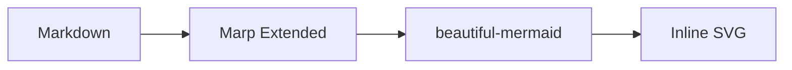

# Marp Extended sample vault

This vault is a compact sample workspace for **Marp Extended**, an Obsidian plugin
based on the original `obsidian-marp-slides` project. It keeps the upstream sample
material for Marp preview/export while adding Marp Extended defaults, Kami themes,
and Mermaid diagram support.

Current plugin metadata: **Marp Extended** `0.4.0`, manifest/package id
`marp-extended`, repository <https://github.com/shuuul/obsidian-marp-extended>.

## What comes from obsidian-marp-slides

The original sample vault demonstrated how to write Marp decks in Obsidian and
export them with Marp CLI. Those examples are still useful for checking baseline
behavior:

- `samples/` — general Marp examples, export-path examples, markdown-it mark and
  container examples.
- `samples themes/` — rendered theme samples and theme test decks.
- `themes/` — bundled Marp CSS themes that can be installed into
  `.marp-extended/themes/`.
- `attachments/` — images used by the sample decks.

Use these files to verify that basic slide rendering, image paths, custom themes,
and export formats still behave like the upstream plugin.

## What Marp Extended adds

Marp Extended adds a maintained plugin identity, refreshed default theme handling,
property suggestions, and Mermaid rendering based on `beautiful-mermaid`.

The most important additions in this vault are:

- `themes/kami.css` — Chinese/CJK Kami Marp theme aligned with
  [`tw93/Kami`](https://github.com/tw93/Kami).
- `themes/kami-en.css` — English Kami Marp theme aligned with Kami's Marp export.
- `mermaid-themes/` — Mermaid-only CSS themes, installed separately from Marp slide
  themes into `.marp-extended/mermaid-themes/`.
- `samples/Kami.md` — Chinese Kami example deck for Marp Extended.
- `samples/Kami.en.md` — English Kami example deck for Marp Extended.
- `samples/Kami Agent Slides.md` — Marp recreation of Kami's `demo-agent-slides.pdf` for visual comparison.

## Kami theme model

Kami uses a warm paper-like visual system:

| Role | Token | Value |
| --- | --- | --- |
| Paper background | `--parchment` | `#f5f4ed` |
| Node/card surface | `--ivory` | `#faf9f5` |
| Main text | `--near-black` | `#141413` |
| Body text | `--dark-warm` | `#3d3d3a` |
| Lines | `--olive` | `#504e49` |
| Secondary text | `--stone` | `#6b6a64` |
| Accent | `--brand` | `#1B365D` |
| Border | `--border` | `#e8e6dc` |

The Kami Marp themes mirror the upstream Kami Marp templates:

```yaml
---
marp: true
theme: kami          # or kami-en
mermaidTheme: kami   # or kami-en
mermaidFlat: true     # optional: blend Mermaid into the slide background
size: kami            # or portfolio for A4 portrait
paginate: true
footer: "Kami · Marp Extended"
---
```

The `kami` size is `280mm × 158mm`, matching the upstream Kami Marp examples.
Kami themes also define a `portfolio` size of `210mm × 297mm`, matching the A4
portrait layout used by Kami's `demo-kaku.pdf` portfolio export.

## Mermaid support

Mermaid is handled separately from Marp slide themes:

- Use `theme` for the Marp slide theme.
- Use `mermaidTheme` for the Mermaid diagram theme.
- Use `mermaidFlat: true` to remove the Mermaid card background, border,
  shadow, and padding when you want the diagram to blend into the page.
- Mermaid fences are rendered by `beautiful-mermaid` as inline SVG.
- During export, Marp Extended preprocesses Mermaid fences into inline SVG before
  running Marp CLI.

Example:

````markdown
---
marp: true
theme: kami
mermaidTheme: kami
mermaidFlat: true
size: kami
paginate: true
---


````

The default Kami Mermaid themes use the same seven-role palette as Kami:

```text
bg      #f5f4ed
surface #faf9f5
fg      #141413
line    #504e49
accent  #1B365D
muted   #6b6a64
border  #e8e6dc
```

## Suggested checks

Open these decks in Obsidian and run **Marp Extended: Slide Preview**:

1. `samples/Kami.md`
2. `samples/Kami.en.md`
3. `samples/Sample Markdown-it Plugins.md`
4. `samples/Academic.md`

Then test export as HTML/PDF/PPTX/PNG. PDF/PPTX/PNG export requires Chrome,
Chromium, Edge, or a configured browser path.
