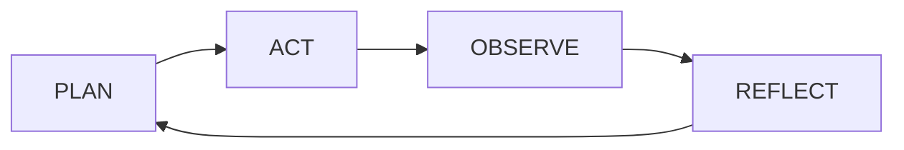
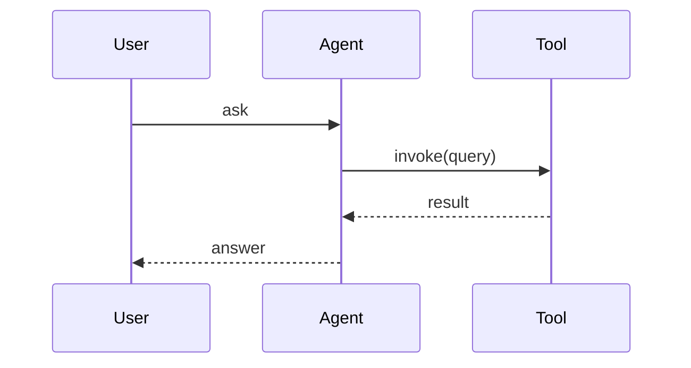
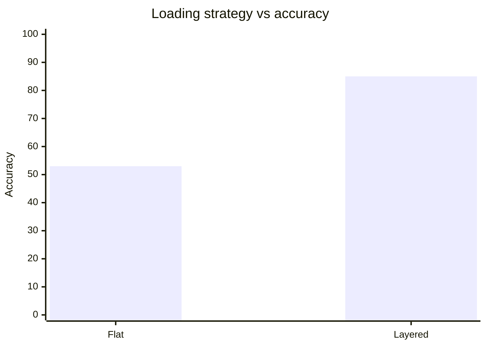

<!-- _class: cover -->
<!-- _paginate: false -->
<!-- _footer: "" -->

# Things you don't know about Agents

<div class="sub">Loops, harness, context, memory: what actually moves the needle in production.</div>
<div class="meta">kami slides demo · Marp Extended · 8 slides</div>

---

<!-- _header: 01 · Agent Loop -->

## Simple core, complex surroundings

<p class="lead">The loop is small. The infrastructure around it is what keeps it stable as features grow.</p>

<div class="c2">

<div>

### What matters

- A working Agent loop fits in about **20 lines** of code.
- Control flow lives in the tools, not in branchy internal state.
- Workflow vs Agent: predefined paths in code vs model picks paths at runtime.

<div class="mc">If your loop keeps growing every sprint, you are fixing the wrong layer. The tax is paid outside the loop.</div>

</div>

<div>



</div>

</div>

---

<!-- _header: 01 · Agent Loop -->

## One turn, traced

<p class="lead">The same loop, made concrete: a single user turn flows through the agent to a tool and back.</p>



---

<!-- _header: 02 · Harness -->

## Harness wins over hardware

<p class="lead">More expensive models bring gains far smaller than expected. Verification, boundaries, feedback, and fallbacks matter more than model capability.</p>

<table class="t2x2">
<tr>
<td>

<div class="mt"><span class="ml">20</span>LOC</div>

Lines of code in a working Agent core loop.

</td>
<td>

<div class="mt"><span class="ml">4</span>layers</div>

Harness layers that matter: verify, bound, feedback, fallback.

</td>
</tr>
<tr>
<td>

<div class="mt"><span class="ml">10×</span>velocity</div>

Gains trace to execution discipline, not model swaps.

</td>
<td>

<div class="mt"><span class="ml">1</span>signal</div>

Evaluation is the only honest signal. Test harness before test model.

</td>
</tr>
</table>

---

<!-- _header: 03 · Context -->

## Density beats length

<p class="lead">Long context windows do not fix weak context design. Context Rot sets in around 300–400K tokens regardless of the model.</p>

<div class="c2">

<div>

### Loading rules

- Layer the load: constant, on-demand, runtime, memory, system.
- Index first, full content on demand.
- Stable prompt prefixes let caching actually pay off.
- Every token that is not load-bearing is diluting signal.

</div>

<div>



</div>

</div>

---

<!-- _header: 04 · Tools & Memory -->

## Put state outside the context

<div class="c2">

<div>

<p class="lead">Tools should match Agent goals, not underlying API shapes. Memory lives on disk, not in the window.</p>

- ACI principle: design for what the Agent wants to do.
- A bad tool description looks like a model failure until you re-read it.
- File-based state survives restarts. In-context state does not.

</div>

<div>

### Four kinds of memory

- **Working**: context window; fast, expensive, temporary.
- **Procedural**: `SKILL.md`; how to behave, loaded lazily.
- **Episodic**: JSONL logs; what happened, appendable.
- **Semantic**: `MEMORY.md`; what to remember across sessions.

</div>

</div>

<div class="co">Cross-session consistency needs explicit consolidation, not hope.</div>

---

<!-- _header: 05 · Code Style -->

## Pseudocode over syntax

<div class="c2">

<div>

<p class="lead">Comments should outnumber code lines. The reader sees logic, not a language tutorial.</p>

- Write the intent first, then the implementation detail below it.
- Variable names describe what a thing is, not what type it has.
- One concept per block. Split ruthlessly.

</div>

<div>

```text
# resolve tool call or decide to stop
function agent_step(context, tools):
  # model picks the next action
  action = model.think(context)

  # terminal condition: model says done
  if action.type == "stop":
    return action.result

  # delegate to the right tool
  result = tools[action.name](action.args)
  return agent_step(context + result, tools)
```

</div>

</div>

---

<!-- _class: cover -->
<!-- _paginate: false -->
<!-- _footer: "" -->

# Protocol first. Then parallelism.

<div class="sub">Fix your evals before you tweak the Agent. Most of what looks like model failure is infrastructure noise in disguise.</div>
<div class="meta">End of Deck</div>
