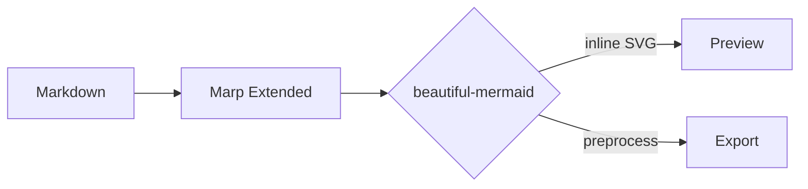

<!-- _class: cover -->
<!-- _paginate: false -->
<!-- _footer: "" -->

# Decks that read like paper

Kami Marp deck · editorial rhythm in Markdown

Kami · 2026

---

<!-- _header: 01 · Origin -->

## Kami WeasyPrint deck, ported to Markdown

Same palette, fonts, layout tokens. Only the file format and editing posture change.

### Shared with Kami slides

- `--parchment` `#f5f4ed` warm cream canvas
- `--brand` `#1B365D` the only chromatic accent
- `--serif` Charter on English, Tsanger on Chinese
- 280×158mm 16:9 page
- `.eyebrow` `.lead` `.co` `.c2` `.t2x2` carry over

### What Marp Extended adds

- Page unit is `section`, not `.slide`
- Page break is `---`, not `break-after: page`
- Pagination via `paginate: true` injects automatically
- Mermaid diagrams use `mermaidTheme: kami-en`
- Preview and export run inside Obsidian

---

<!-- _header: 02 · Four pillars -->

## Four decisions to lock before writing

<table class="t2x2">
<tr>
<td>

APalette

One ink-blue accent, never above 5% of surface area. Warm neutrals carry the rest. No cool gray, no pure white.

</td>
<td>

BType

One serif per page. Body 400, headings 500. No synthetic bold. Charter for EN, Tsanger W04 / W05 for CN.

</td>
</tr>
<tr>
<td>

CLayout

`.c2` two-column via CSS Grid. `.t2x2` four-quadrant via HTML `<table>`. Grid will not align row heights in a 2×2.

</td>
<td>

DRhythm

`--rhythm-module: 14pt` and `--rhythm-section: 18pt`. Two tokens govern all spacing. Do not sprinkle ad-hoc margins.

</td>
</tr>
</table>

---

<!-- _header: 03 · Mermaid -->

## Diagrams follow the paper rhythm too

Marp Extended renders Mermaid with beautiful-mermaid as inline SVG, then applies Kami’s seven-role palette through `mermaidTheme`.

Ivory nodes, olive connectors, and ink-blue only for focal arrows.

---

<!-- _header: 04 · Title rule -->

## Slide titles are claims, not labels

“Q3 results” is a topic. “Q3 revenue beat by 12%” is a claim.

Avoid noun phrases like “Q3 results” or “Team intro”. Rewrite to “Q3 revenue beat guidance by 12 percent” or “The team has only built retrieval for five years”. A reader scanning titles should leave with the takeaway; the body just supplies evidence.

Title carries the claim. Body grounds it. The deck gains a spine.

---

<!-- _header: 05 · Render matrix -->

## One Markdown source, three export targets

<table class="data">
<tr><td>Obsidian preview</td><td>0 MB extra download</td><td>Render Marp slides while editing</td></tr>
<tr><td>PDF export</td><td>~150 MB Chromium, or reuse local Chrome</td><td>Best for delivery and archival</td></tr>
<tr><td>PPTX export</td><td>Same dependency as PDF</td><td>Slide-image dump; not an editable deck</td></tr>
<tr><td>Mermaid diagrams</td><td>beautiful-mermaid inline SVG</td><td>Styled through `mermaidTheme`</td></tr>
</table>

---

<!-- _class: cover -->
<!-- _paginate: false -->
<!-- _footer: "" -->

# Copy it, swap in your story

Replace the content. Leave the structure alone.

github.com/tw93/Kami

