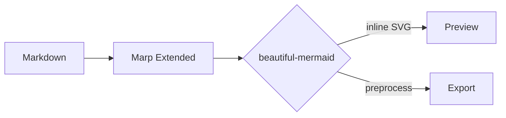

<!-- _class: cover -->
<!-- _paginate: false -->
<!-- _footer: "" -->

# 把幻灯片做成纸

Kami Marp deck · 用 Markdown 写出版面

Kami · 2026

---

<!-- _header: 01 · 出处 -->

## 把 Kami slides 搬到 Markdown 上

同一套色板、字体、布局 token。换的是文件格式与编辑姿势。

### 共享的部分

- `--parchment` `#f5f4ed` 暖纸底色
- `--brand` `#1B365D` 单一墨蓝
- `--serif` 中文 TsangerJinKai02 / 英文 Charter
- 280×158mm 16:9 页面
- `.eyebrow` `.lead` `.co` `.c2` `.t2x2` 一致

### Marp Extended 增加的部分

- 页面单元用 `section`，不是 `.slide`
- 分页用 `---`，不是 `break-after: page`
- 页码用 `paginate: true` 自动注入
- Mermaid 用 `mermaidTheme: kami` 单独设定
- 在 Obsidian 中实时预览与导出

---

<!-- _header: 02 · 四个支柱 -->

## 一张 deck 立不立得住，看这四件事

<table class="t2x2">
<tr>
<td>

A色板

单一墨蓝做强调色，全场 ≤ 5% 面积。其余靠暖中性灰承托。绝对不要冷色、不要纯白底。

</td>
<td>

B字体

一页一种衬线，body 400、heading 500，禁止合成粗体。中文 W04/W05 双字重，英文 Charter 一套通吃。

</td>
</tr>
<tr>
<td>

C布局

`.c2` 两栏走 grid，`.t2x2` 四象限必须用 table，Grid 在四象限里行高对不齐。

</td>
<td>

D节奏

`--rhythm-module: 14pt`、`--rhythm-section: 18pt`。两个数管整套间距，不要再随手加 margin。

</td>
</tr>
</table>

---

<!-- _header: 03 · Mermaid -->

## 图表也跟随纸面节奏，而不是另起炉灶

Marp Extended 用 beautiful-mermaid 生成 inline SVG，再用 `mermaidTheme` 套 Kami 七角色色板。

节点用 ivory，连线用 olive，箭头强调只用 brand blue。

---

<!-- _header: 04 · 标题原则 -->

## 标题写完整断言，不是话题标签

「Q3 业绩」是话题，「Q3 营收高出 12 个点」是断言。

避免 “Q3 业绩 / 团队介绍 / 下一步规划” 这种 noun phrase。改写成「Q3 营收比 guidance 高出 12 个百分点」「团队五年只做检索一件事」「下一季度把延迟从 800ms 压到 120ms」这种带结论的句子。读者扫标题就能拿到 takeaway，正文是支撑证据。

标题先有立场，正文再补证据，整套 deck 就有了主线。

---

<!-- _header: 05 · 渲染矩阵 -->

## 一份 Markdown，三种导出口径

<table class="data">
<tr><td>Obsidian 预览</td><td>0 MB 额外下载</td><td>编辑器内即时查看 Marp slide</td></tr>
<tr><td>PDF 导出</td><td>~150 MB Chromium 或复用本地 Chrome</td><td>适合交付与归档</td></tr>
<tr><td>PPTX 导出</td><td>同 PDF，依赖浏览器</td><td>幻灯片图像化，非可编辑 deck</td></tr>
<tr><td>Mermaid 图表</td><td>beautiful-mermaid inline SVG</td><td>跟随 `mermaidTheme` 主题</td></tr>
</table>

---

<!-- _class: cover -->
<!-- _paginate: false -->
<!-- _footer: "" -->

# 复制走，开始你自己的 deck

把内容换成你的故事，结构留下不动

github.com/tw93/Kami

