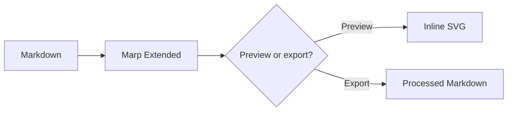

<!-- _class: lead -->
# Title

## Subtitle

---

<!-- _class: box-flex -->
# Columns Containers

**[markdown-it-container](https://github.com/markdown-it/markdown-it-container)**

::: container
## Column 1

text text text text text text text text text text

:::

::: container
## Column 2

text

:::

---

# Text Highlights

**[markdown-it-mark](https://github.com/markdown-it/markdown-it-mark)**

This is ==marked== text

---

# Mermaid Diagram

**Built-in Marp Extended Mermaid support**

---

# CallOuts (Work in Progress)

https://github.com/ebullient/markdown-it-obsidian-callouts
